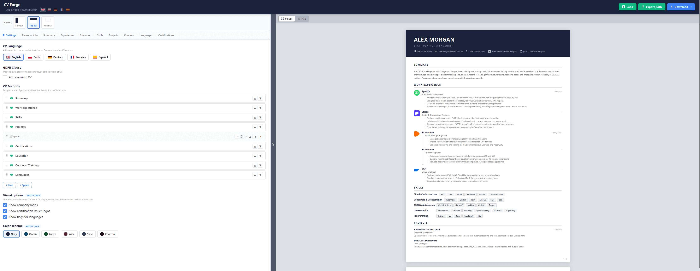
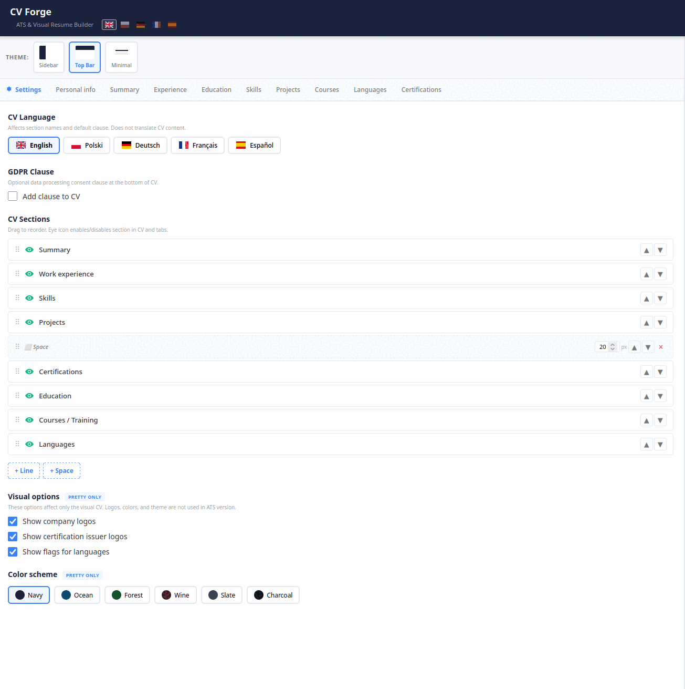
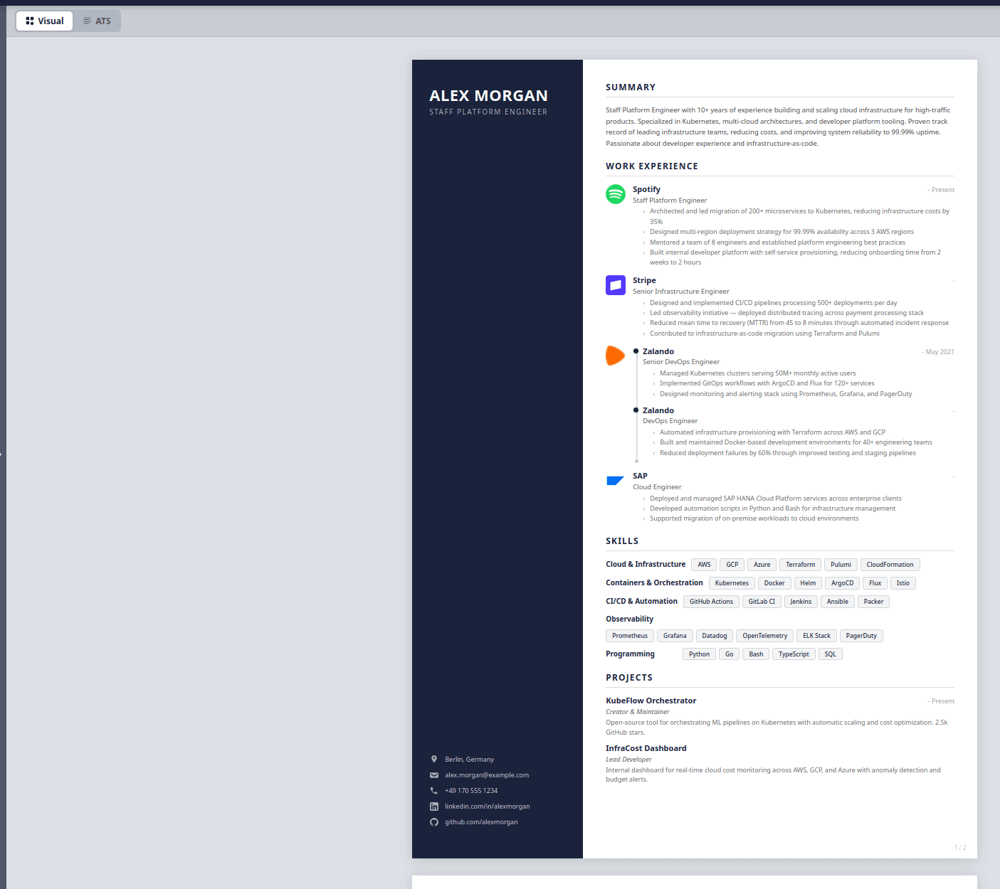
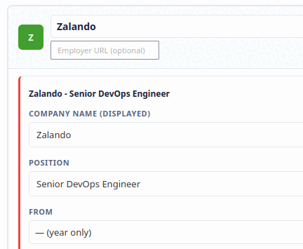

# CV Forge

A modern, privacy-first CV/resume builder that runs entirely in your browser. Create professional CVs with live preview, multiple themes, and export to PDF or DOCX — no account required, no data leaves your machine.


## Try It

> **https://cv.guidlab.pl** — live demo, no signup needed



## Features

- **Live preview** — see changes instantly as you type
- **Three themes** — Sidebar, Top Bar, and Minimal layouts
- **ATS-friendly export** — DOCX and PDF optimized for applicant tracking systems
- **Pretty PDF export** — pixel-perfect PDF matching the visual preview (via Chromium headless)
- **Multi-language CV** — section titles in English, Polish, German, French, Spanish
- **Multi-language UI** — full interface translation (EN/PL/DE/FR/ES) with browser language auto-detection
- **GDPR/RODO clause** — toggleable consent clause with per-language defaults
- **Candidate photo** — optional photo support for visual CV themes
- **Company logos** — auto-fetch from URL or upload manually
- **Certification logos** — grouped certifications with issuer branding
- **Language flags** — built-in flag icons for 25+ countries, custom flag upload
- **Color schemes** — 6 built-in color palettes
- **Drag & drop sections** — reorder CV sections, add separators
- **Rich text descriptions** — bullet points or paragraph mode with formatting toolbar
- **Date validation** — visual warning when date ranges are inconsistent
- **Privacy-first** — all data stored in browser localStorage, nothing sent to any server
- **Auto-save** — changes saved automatically to localStorage
- **Import/Export JSON** — backup and restore your CV data

## System Requirements

### Required

| Dependency | Version | Purpose |
|-----------|---------|---------|
| **Python** | 3.10+ | Backend runtime |
| **pip** | any | Python package manager |

### Required for PDF export

| Dependency | Purpose | Install (Debian/Ubuntu) | Install (Arch) | Install (macOS) |
|-----------|---------|------------------------|----------------|-----------------|
| **Chromium** or **Google Chrome** | Pretty PDF generation (visual CV to PDF) | `sudo apt install chromium` | `sudo pacman -S chromium` | `brew install --cask chromium` |
| **LibreOffice Writer** | ATS PDF generation (DOCX to PDF) | `sudo apt install libreoffice-writer` | `sudo pacman -S libreoffice-still` | `brew install --cask libreoffice` |

> Without Chromium, the "Pretty PDF" download will fail. Without LibreOffice, the "ATS PDF" download will fail. ATS DOCX export and the rest of the application work without either.

### Python dependencies (installed automatically via pip)

| Package | Version | Purpose |
|---------|---------|---------|
| flask | 3.1.0 | Web framework |
| flask-limiter | 3.12 | API rate limiting |
| python-docx | 1.1.2 | DOCX generation |

## Quick Start

### Option 1: Docker Hub (recommended)

```bash
docker run -p 5000:5000 guidlab/cv-forge
```

One command, everything included — Python, Chromium, LibreOffice, and all fonts.

### Option 2: Build from source

```bash
git clone https://github.com/Guid-Lab/cv-forge.git
cd cv-forge
docker compose up
```

### Option 3: Manual setup

```bash
git clone https://github.com/Guid-Lab/cv-forge.git
cd cv-forge
python3 -m venv venv
source venv/bin/activate
pip install -r requirements.txt
python app.py
```

Make sure Chromium and LibreOffice are installed on your system (see [System Requirements](#system-requirements)).

Then open [http://localhost:5000](http://localhost:5000).

## Editor Panels



## Themes



## CV as JSON

Your entire CV is stored as a single, human-readable JSON file. Use **Export JSON** to download it and **Load** to restore it in any CV Forge instance — no account, no cloud, no vendor lock-in.

- **Portable** — one file contains all your data: experience, skills, education, settings, section order
- **Backup-friendly** — save it on disk, Dropbox, USB drive, wherever you keep important files
- **Multi-version** — keep separate JSON files per role or language (`cv_backend.json`, `cv_deutsch.json`)
- **Transferable** — works across browsers and machines, just load the file

See [`example_data.json`](example_data.json) for the full schema reference.

## Auto Logo Fetch



Paste a company, university, or certification issuer URL and CV Forge will automatically fetch the logo. Works for employers, education institutions, and certification issuers. You can also upload a logo manually.

## AI Integration (MCP)

CV Forge can be used as an AI tool via [MCP (Model Context Protocol)](https://github.com/Guid-Lab/cv-forge-mcp). Describe your experience in a conversation with Claude or another AI assistant, and it will generate a complete CV for you — PDF, DOCX, and a link to the visual editor.

```bash
# Install MCP server
git clone https://github.com/Guid-Lab/cv-forge-mcp.git
cd cv-forge-mcp && pip install -r requirements.txt

# Add to Claude Code
claude mcp add cv-forge python /path/to/cv-forge-mcp/mcp_server.py
```

The MCP server automatically manages the Docker container — no manual setup needed.

See [cv-forge-mcp](https://github.com/Guid-Lab/cv-forge-mcp) for full documentation.

## Export Formats

| Format | Description | Engine | Requires |
|--------|-------------|--------|----------|
| **ATS DOCX** | Clean, parseable Word document | python-docx | Python only |
| **ATS PDF** | Simple text PDF from DOCX | LibreOffice headless | LibreOffice |
| **Pretty PDF** | Visual CV identical to preview | Chromium headless | Chromium/Chrome |

## Tech Stack

| Layer | Technology |
|-------|-----------|
| Backend | Python 3 + Flask |
| Frontend | Vanilla JavaScript (no frameworks) |
| Styling | Custom CSS (no dependencies) |
| ATS DOCX | python-docx |
| ATS PDF | LibreOffice headless (DOCX to PDF) |
| Pretty PDF | Chromium headless (`--print-to-pdf`) |
| Storage | Browser localStorage |

## Project Structure

```
cv-forge/
├── app.py              # Flask routes and API endpoints
├── cv_generator.py     # DOCX/PDF generation logic
├── pdf_renderer.py     # Chromium headless PDF rendering
├── requirements.txt    # Python dependencies
├── Dockerfile          # Container config (Python + Chromium + LibreOffice)
├── docker-compose.yml  # Docker Compose with resource limits
├── static/
│   ├── css/style.css   # All styles (themes, preview, UI)
│   ├── js/
│   │   ├── i18n.js     # UI translations (EN/PL/DE/FR/ES)
│   │   ├── data.js     # CV data constants and helpers
│   │   ├── preview.js  # Visual and ATS preview rendering
│   │   └── app.js      # Main application logic
│   └── favicon.svg
└── templates/
    └── index.html      # Single-page application template
```

## API Endpoints

| Method | Path | Description |
|--------|------|-------------|
| `GET` | `/` | Serve the SPA |
| `POST` | `/api/generate/docx` | Generate ATS DOCX |
| `POST` | `/api/generate/pdf` | Generate Pretty PDF |
| `POST` | `/api/generate/ats-pdf` | Generate ATS PDF |
| `POST` | `/api/fetch-logo` | Proxy logo fetch (SSRF-safe) |
| `POST` | `/api/load-data` | Store CV data temporarily (for MCP/URL sharing) |
| `GET` | `/api/load-data/<token>` | Retrieve stored CV data (one-time, 5min TTL) |

## Security

- All API endpoints are rate-limited (flask-limiter)
- Origin header check on all API routes (CSRF protection)
- SSRF protection on logo fetch (DNS resolution + `ip.is_global` check)
- HTML sanitization on both client (JS) and server (Python) side
- Chromium runs with `--disable-javascript` for PDF rendering
- Security headers: CSP, HSTS, X-Frame-Options, X-Content-Type-Options
- Docker: non-root user, memory/CPU/PID limits
- No data stored server-side, all CV data stays in browser localStorage

## License

[MIT](LICENSE)
